# Anichive

Anime Archive (Anichive, formerly Artist Alley Database), is an app in two parts. It is an
UNOFFICIAL client for [AniList.co](https://anilist.co), which allows the user to search and track
anime/manga.

It is also an app to catalog art prints obtained from anime conventions in an easily searchable
format with support for tagging metadata like the series, characters, and artists of each piece.

## Disclaimers

Use of this app requires usage of the
[AniList GraphQL API](https://anilist.gitbook.io/anilist-apiv2-docs/), and by using it, the user
accepts the AniList [terms of service](https://anilist.co/terms).

Release builds designed to be shipped to stores filter based on AniList's `isAdult` flag, but this
is disabled when building debug/internal from source.

There is no guarantee that imports and exports will work across versions until the format is
stabilized, nor that the data is safe from corruption or bugs. Use and update at your own risk.

All source is open and available on GitHub except signing keys and API secrets.

## Features

### AniList client
Free features:
- Full featured anime/manga search and filter
- View details of anime, manga, characters, staff, studios, users, etc.
- Get news through AnimeNewsNetwork and Crunchyroll News RSS integrations
- See global user activity

Features if optional ads are enabled:
- Log in to AniList account
- Edit and rate anime/manga entries
- Search characters, staff, studios, users, activity
- Watching/reading and user lists
- Requires persistent banner ad on bottom of screen

Features under paid subscription:
- Completely remove ads
- Databasing features used to track art prints, CDs, or merch in general from anime conventions
- Import/export support for database
- Comprehensive integration with AniList API to tag art/CDs with characters and staff
- Search to quickly pull up art at conventions to prevent duplicates
- These features are experimental

### Databasing
- Image associated with entry, which is copied into the application's private data dir
- Fields including:
  - Series (manga, anime, custom text)
  - Characters (from AniList API, custom text)
  - Source (unknown, convention, custom text)
  - Artist
  - Tags (generic text entries)
  - Physical size (width by length in millimeters)
  - Notes (generic long form text)
- Ability to lock fields to prevent them from being accidentally edited
- Rudimentary search by field
- Browse by artist, series, characters, and tag
- Export and import of entire database with images to/from a (mostly) user readable .zip file

## Screenshots

TODO: Need to find an artist willing to license their work to be displayed in this repository.
(If you draw anime art and are willing, please contact my GitHub email)

## Build

Instructions assume Windows 11 environment using the latest Android Studio Canary build.

1. Clone project with `git clone https://github.com/TheKeeperOfPie/ArtistAlleyDatabase.git`
2. Get a copy of any local dependencies and place it into `libs`:
   - SNAPSHOT version, so can't use stable version code for dependency verification.  
   ```https://s01.oss.sonatype.org/content/repositories/snapshots/com/mxalbert/sharedelements/shared-elements/0.1.0-SNAPSHOT/shared-elements-0.1.0-20221204.093513-11.aar```
3. Generate an AniList API client by following the API instructions [here](https://anilist.gitbook.io/anilist-apiv2-docs/overview/oauth/getting-started#using-oauth)
4. Create `/secrets.properties` and insert the client ID as a property:
    ```
    aniList.clientId=$CLIENT_ID
    ```
   TODO: Missing other properties
5. Install like any other Android application via `./gradlew :app:installDebug`

### Gradle

This project attempts to store the Gradle home and build caches directly inside the project root
under `/gradle-home` and `/build-cache`. This allows easy configurable of anti-virus scanning
exclusions and caching efforts, as all data is ideally read from just the project folder.

A minor benefit of this is that by deleting the two folders (along with `.gradle`), a true clean
build can be tested, where Gradle cannot reference anything it used previously.

## Dependencies

### Useful commands

- Check for updates:  
  `./gradlew dependencyUpdates`
- Verify declarations (included in git commit hook):  
  `./gradlew buildHealth`

### Regenerate verification-metadata.xml

This must be done each time a dependency is added/changed. Disabling dependency verification can be
done by deleting [`./gradle/verification-metadata.xml`](gradle/verification-metadata.xml).

[//]: # (TODO: Full clean build is starting to get annoying, need better way to regenerate metadata)

`./gradlew --no-configuration-cache --write-verification-metadata sha256 generateVerificationMetadata --stacktrace`

### :modules:dependencies

This module serves as a way to generate verification metadata for artifacts which are used by
Android Studio but aren't used in the app build. For things like instrumentation testing that
require additional dependencies.

## Releasing
1. Rename the top entry of [`changelog.md`](changelog.md) to the next release version name
2. Create a new entry in [`changelog.md`](changelog.md) for the `Next ($versionCode)` release
3. Increment the version code and name in [`app/build.gradle.kts`](app/build.gradle.kts)
4. Studio toolbar > Build > Generate Signed App Bundle > auth for keystore > create `release`
5. Upload release from [`/app/release`](app/release)

## Module Graph
<details>
    <summary>Expand for graph</summary>

#### Start Module Graph

```mermaid
%%{
  init: {
    'theme': 'dark'
  }
}%%

graph LR
  subgraph :modules
    :modules:utils["utils"]
    :modules:utils-compose["utils-compose"]
    :modules:test-utils["test-utils"]
    :modules:utils-network["utils-network"]
    :modules:browse["browse"]
    :modules:utils-inject["utils-inject"]
    :modules:entry["entry"]
    :modules:utils-room["utils-room"]
    :modules:image["image"]
    :modules:musical-artists["musical-artists"]
    :modules:secrets["secrets"]
    :modules:anime2anime["anime2anime"]
    :modules:anilist["anilist"]
    :modules:anime["anime"]
    :modules:animethemes["animethemes"]
    :modules:debug["debug"]
    :modules:play["play"]
    :modules:art["art"]
    :modules:cds["cds"]
    :modules:data["data"]
    :modules:markdown["markdown"]
    :modules:media["media"]
    :modules:monetization["monetization"]
    :modules:settings["settings"]
    :modules:vgmdb["vgmdb"]
    :modules:apollo["apollo"]
    :modules:server["server"]
  end
  subgraph :modules:anilist
    :modules:anilist:data["data"]
  end
  subgraph :modules:anime
    :modules:anime:ui["ui"]
    :modules:anime:news["news"]
    :modules:anime:recommendations["recommendations"]
    :modules:anime:data["data"]
    :modules:anime:favorites["favorites"]
  end
  subgraph :modules:anime:ignore
    :modules:anime:ignore:data["data"]
  end
  subgraph :modules:anime:media
    :modules:anime:media:data["data"]
  end
  subgraph :modules:apollo
    :modules:apollo:utils["utils"]
  end
  subgraph :modules:monetization
    :modules:monetization:debug["debug"]
    :modules:monetization:unity["unity"]
  end
  :modules:anime:ui --> :modules:utils
  :modules:anime:ui --> :modules:utils-compose
  :modules:anime:ui --> :modules:test-utils
  :modules:anime:ui --> :modules:utils-network
  :modules:browse --> :modules:utils-inject
  :modules:browse --> :modules:entry
  :modules:browse --> :modules:utils
  :modules:browse --> :modules:utils-compose
  :modules:browse --> :modules:test-utils
  :modules:browse --> :modules:utils-network
  :modules:utils-room --> :modules:test-utils
  :modules:utils-room --> :modules:utils-network
  :modules:image --> :modules:utils
  :modules:image --> :modules:utils-compose
  :modules:image --> :modules:utils-inject
  :modules:image --> :modules:test-utils
  :modules:image --> :modules:utils-network
  :modules:musical-artists --> :modules:utils-inject
  :modules:musical-artists --> :modules:test-utils
  :modules:musical-artists --> :modules:utils-network
  :modules:secrets --> :modules:test-utils
  :modules:secrets --> :modules:utils-network
  :modules:anime2anime --> :modules:utils-inject
  :modules:anime2anime --> :modules:anilist
  :modules:anime2anime --> :modules:anime
  :modules:anime2anime --> :modules:anime:ignore:data
  :modules:anime2anime --> :modules:anime:media:data
  :modules:anime2anime --> :modules:anime:news
  :modules:anime2anime --> :modules:anime:recommendations
  :modules:anime2anime --> :modules:utils
  :modules:anime2anime --> :modules:utils-compose
  :modules:anime2anime --> :modules:test-utils
  :modules:anime2anime --> :modules:utils-network
  :app --> :modules:monetization:debug
  :app --> :modules:animethemes
  :app --> :modules:debug
  :app --> :modules:play
  :app --> :modules:monetization:unity
  :app --> :modules:anime
  :app --> :modules:anime2anime
  :app --> :modules:anilist
  :app --> :modules:art
  :app --> :modules:browse
  :app --> :modules:cds
  :app --> :modules:image
  :app --> :modules:data
  :app --> :modules:entry
  :app --> :modules:markdown
  :app --> :modules:media
  :app --> :modules:monetization
  :app --> :modules:utils-inject
  :app --> :modules:utils-room
  :app --> :modules:settings
  :modules:animethemes --> :modules:utils-inject
  :modules:animethemes --> :modules:anime
  :modules:animethemes --> :modules:anilist
  :modules:animethemes --> :modules:utils-network
  :modules:animethemes --> :modules:test-utils
  :modules:anime:ignore:data --> :modules:anilist
  :modules:anime:ignore:data --> :modules:anime:data
  :modules:anime:ignore:data --> :modules:utils-inject
  :modules:anime:ignore:data --> :modules:utils
  :modules:anime:ignore:data --> :modules:test-utils
  :modules:anime:ignore:data --> :modules:utils-network
  :modules:cds --> :modules:anilist
  :modules:cds --> :modules:browse
  :modules:cds --> :modules:data
  :modules:cds --> :modules:entry
  :modules:cds --> :modules:musical-artists
  :modules:cds --> :modules:vgmdb
  :modules:cds --> :modules:utils-inject
  :modules:cds --> :modules:utils
  :modules:cds --> :modules:utils-room
  :modules:cds --> :modules:test-utils
  :modules:cds --> :modules:utils-network
  :modules:anime:recommendations --> :modules:anilist
  :modules:anime:recommendations --> :modules:anime:ignore:data
  :modules:anime:recommendations --> :modules:anime:favorites
  :modules:anime:recommendations --> :modules:anime:media:data
  :modules:anime:recommendations --> :modules:utils-inject
  :modules:anime:recommendations --> :modules:utils
  :modules:anime:recommendations --> :modules:utils-compose
  :modules:anime:recommendations --> :modules:test-utils
  :modules:anime:recommendations --> :modules:utils-network
  :modules:anime:data --> :modules:test-utils
  :modules:anime:data --> :modules:utils-network
  :modules:anime:media:data --> :modules:anilist
  :modules:anime:media:data --> :modules:anime:data
  :modules:anime:media:data --> :modules:anime:favorites
  :modules:anime:media:data --> :modules:anime:ignore:data
  :modules:anime:media:data --> :modules:anime:ui
  :modules:anime:media:data --> :modules:utils-inject
  :modules:anime:media:data --> :modules:utils
  :modules:anime:media:data --> :modules:utils-compose
  :modules:anime:media:data --> :modules:test-utils
  :modules:anime:media:data --> :modules:utils-network
  :modules:media --> :modules:utils-inject
  :modules:media --> :modules:test-utils
  :modules:media --> :modules:utils-network
  :modules:debug --> :modules:utils-inject
  :modules:debug --> :modules:utils
  :modules:debug --> :modules:utils-compose
  :modules:debug --> :modules:utils-network
  :modules:debug --> :modules:test-utils
  :modules:anime:favorites --> :modules:anilist
  :modules:anime:favorites --> :modules:utils-inject
  :modules:anime:favorites --> :modules:utils
  :modules:anime:favorites --> :modules:test-utils
  :modules:anime:favorites --> :modules:utils-network
  :modules:anilist:data --> :modules:apollo:utils
  :modules:anilist:data --> :modules:test-utils
  :modules:anilist:data --> :modules:utils-network
  :modules:anilist:data --> :modules:apollo
  :modules:vgmdb --> :modules:entry
  :modules:vgmdb --> :modules:utils
  :modules:vgmdb --> :modules:utils-compose
  :modules:vgmdb --> :modules:utils-network
  :modules:vgmdb --> :modules:utils-inject
  :modules:vgmdb --> :modules:test-utils
  :modules:utils-network --> :modules:utils-inject
  :modules:utils-network --> :modules:test-utils
  :modules:utils-compose --> :modules:utils-inject
  :modules:utils-compose --> :modules:secrets
  :modules:utils-compose --> :modules:utils
  :modules:utils-compose --> :modules:test-utils
  :modules:utils-compose --> :modules:utils-network
  :modules:anime --> :modules:anime:favorites
  :modules:anime --> :modules:anime:ignore:data
  :modules:anime --> :modules:anime:media:data
  :modules:anime --> :modules:anime:news
  :modules:anime --> :modules:anime:recommendations
  :modules:anime --> :modules:utils-inject
  :modules:anime --> :modules:anilist
  :modules:anime --> :modules:anime:data
  :modules:anime --> :modules:anime:ui
  :modules:anime --> :modules:cds
  :modules:anime --> :modules:markdown
  :modules:anime --> :modules:media
  :modules:anime --> :modules:monetization
  :modules:anime --> :modules:utils-compose
  :modules:anime --> :modules:utils-network
  :modules:anime --> :modules:test-utils
  :modules:monetization:debug --> :modules:monetization
  :modules:monetization:debug --> :modules:utils-inject
  :modules:monetization:debug --> :modules:test-utils
  :modules:monetization:debug --> :modules:utils-network
  :modules:settings --> :modules:anime
  :modules:settings --> :modules:art
  :modules:settings --> :modules:cds
  :modules:settings --> :modules:monetization
  :modules:settings --> :modules:secrets
  :modules:settings --> :modules:utils-inject
  :modules:settings --> :modules:anime:ignore:data
  :modules:settings --> :modules:anime:media:data
  :modules:settings --> :modules:anime:news
  :modules:settings --> :modules:test-utils
  :modules:settings --> :modules:utils-network
  :modules:anime:news --> :modules:utils-inject
  :modules:anime:news --> :modules:utils
  :modules:anime:news --> :modules:utils-compose
  :modules:anime:news --> :modules:test-utils
  :modules:anime:news --> :modules:utils-network
  :modules:art --> :modules:anilist
  :modules:art --> :modules:browse
  :modules:art --> :modules:data
  :modules:art --> :modules:entry
  :modules:art --> :modules:utils-inject
  :modules:art --> :modules:utils-compose
  :modules:art --> :modules:utils-room
  :modules:art --> :modules:test-utils
  :modules:art --> :modules:utils-network
  :modules:data --> :modules:anilist
  :modules:data --> :modules:entry
  :modules:data --> :modules:utils
  :modules:data --> :modules:utils-inject
  :modules:data --> :modules:test-utils
  :modules:data --> :modules:utils-network
  :modules:test-utils --> :modules:utils-inject
  :modules:test-utils --> :modules:utils-network
  :modules:test-utils --> :modules:server
  :modules:server --> :modules:test-utils
  :modules:server --> :modules:anilist:data
  :modules:utils-inject --> :modules:test-utils
  :modules:utils-inject --> :modules:utils-network
  :modules:monetization --> :modules:utils
  :modules:monetization --> :modules:utils-compose
  :modules:monetization --> :modules:utils-inject
  :modules:monetization --> :modules:test-utils
  :modules:monetization --> :modules:utils-network
  :modules:markdown --> :modules:utils-inject
  :modules:markdown --> :modules:test-utils
  :modules:markdown --> :modules:utils-network
  :modules:play --> :modules:monetization
  :modules:play --> :modules:utils-inject
  :modules:play --> :modules:test-utils
  :modules:play --> :modules:utils-network
  :modules:monetization:unity --> :modules:monetization
  :modules:monetization:unity --> :modules:secrets
  :modules:monetization:unity --> :modules:utils-inject
  :modules:monetization:unity --> :modules:test-utils
  :modules:monetization:unity --> :modules:utils-network
  :modules:apollo:utils --> :modules:utils-inject
  :modules:apollo:utils --> :modules:utils
  :modules:apollo:utils --> :modules:test-utils
  :modules:apollo:utils --> :modules:utils-network
  :modules:apollo --> :modules:test-utils
  :modules:entry --> :modules:image
  :modules:entry --> :modules:utils-inject
  :modules:entry --> :modules:markdown
  :modules:entry --> :modules:utils
  :modules:entry --> :modules:utils-compose
  :modules:entry --> :modules:utils-room
  :modules:entry --> :modules:test-utils
  :modules:entry --> :modules:utils-network
  :modules:utils --> :modules:utils-inject
  :modules:utils --> :modules:test-utils
  :modules:utils --> :modules:utils-network
  :modules:anilist --> :modules:anilist:data
  :modules:anilist --> :modules:entry
  :modules:anilist --> :modules:apollo:utils
  :modules:anilist --> :modules:secrets
  :modules:anilist --> :modules:utils-inject
  :modules:anilist --> :modules:utils
  :modules:anilist --> :modules:utils-compose
  :modules:anilist --> :modules:utils-network
  :modules:anilist --> :modules:test-utils
```


#### End module graph
</details>

## Licensing

TODO: Add a real license
All rights reserved, no warranty or support provided, no commercial derivatives allowed. Individuals
are allowed to edit and build the app for personal use, but cannot distribute copies. If you build
this app to avoid ads/monetization, please consider donating. 